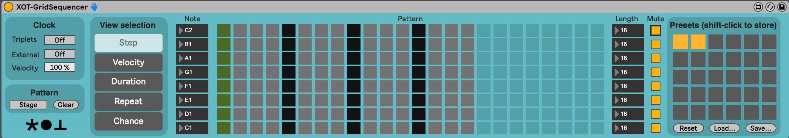

# XOT-GridSequencer

A Max for Live grid sequencer inspired by Garage Bands Beat Sequencer.

(c) Jaap-Henk Hoepman (info@xot.nl)

Released under the [MIT](https://opensource.org/licenses/MIT) license. 

## Introduction

This grid sequencer allows you to program a bar containing eight independent voices. Each bar is subdivided into at most 24 sixteenth notes (or sixteenth triplet notes when the 'triplets' switch is on). This can be set for each voice independently. Each voice corresponds to a fixed, user assignable, note. For each voice, notes can be turned on or off, assigned a certain velocity, duration, flagged to be repeated, or triggered with a certain probability.

The sequencer can be driven using an internal clock (that syncs with Live's tempo) ensuring that even in non standard time signatures the sequencer advances one step every sixteenth (triplet) notes.

The sequencer can also be driven using incoming MIDI notes. In that case each MIDI note on message advances the sequencer one step. This is useful to drive the sequencer with a groove.

The user interface of the grid sequencer is divided into four panels. The leftmost clock panel is used to configure the clock signal used to drive the grid sequencer. The view selection is used to select which view is shown in the grid immediately right of it. The rightmost panel contains the presets. Each panel is explained in detail belows.

## View selection and the grid

The central panel shows a grid of eight voices (one per row) for a bar that is by default divided into four beats containing four sixteenth notes each. The information shown in the grid depends on the selected view. There are five different views: Step, Velocity, Duration, Repeat, and Chance. These views are described below. The clear button at the top of the grid clears the grid and resets all views to their default contents.

Step
: Each slot is either selected (orange) or off. Selected slots trigger the corresponding note when the green playback cursor (advanced by the clock) reaches the slot. The default is off. (In other views a small orange bar at the bottom of the row indicates which steps are active, allowing to quickly recognise the pattern in other views as well.)

Velocity
: Each slot is a vertical slider. If the corresponding step slot is selected, the slider in a slot determines the velocity of the outgoing MIDI note. Sliders can be dragged up (for the maximum velocity 127) and down (for minimum velocity 0). The default is 127.

Duration
: Each slot is contains a note symbol representing the selected length. Possible lengths are: 1/32, 1/16, 3/32, 1/8, 3/16, 1/4, 3/8, 1/2. Clicking a slot selects the next longer lasting note (or jumps back to a 1/32th note).
If the corresponding step slot is selected, this slot determines for how long a note is played. When notes are repeated (see below), this only affects the duration of the last note played. The default is 1/32.

Repeat
: Each slot contains 1,2,3 or four bars, representing how often the note should be repeated (if the corresponding step slot is selected). Clicking a slot adds another repetition (or jumps back to 1). The default is 1.

Chance
: Each slot is a vertical slider. If the corresponding step slot is selected, the slider in a slot determines the probability the note (including all its repetitions) is actually played. Sliders can be dragged up (for the maximum probability 100%) and down (for minimum probability 0%). The default is 100%.

## Changing the grid length and notes played

The box to the left of each voice in the grid contains the MIDI note to be played for each selected step. This can be dragged up or down.

The box to the right of each voice in the grid contains the length (i.e. the number of slots) that can be programmed for the voice. This can be dragged up and down to select any value between 1 and 24.

## Staging

Turning the Stage button (in the view selection panel) on allows you to edit a new drum pattern while the current pattern keeps playing. The new pattern will be played (and the old pattern will be lost) as soon as the Stage button is turned off again. To keep the old pattern, save it to a preset first.

## Running the sequencer, and the clock panel

Starting and stopping the grid sequencer is done using the start and stop buttons in Ableton Live's main transport bar. When the grid sequencer is stopped, the playback position (the green cursor) for each voice is reset to the first cell in the grid for that voice. This is also the initial position.

When the grid sequencer is started the first slot of each voice is activated (and if the corresponding Step cell is selected the corresponding note is played as explained above).

Normally (when the external clock is off), the payback position for each voice advances one position to the right with each sixteenth note (or sixteenth triplet note when the 'triplets' switch is on), thus activating the next cell. When reaching the end of a row, the playback position moves back to the first cell.

When the external clock is on (using the External button), the sequencer is driven using MIDI notes played in the Ableton track instead. In that case each MIDI note on message advances the sequencer one step. This is useful to drive the sequencer with a groove. To use this feature, you could for example drag the required groove (from the Ableton Core Library) into an empty slot in the track to convert it to a Midi clip. The velocity of incoming MIDI notes is used to globally attenuate the voices played by the sequencer, to further control the groove. The Velocity value can be used to control the depth of this attenuation: at 100% the attenuation is maximal, at 0% incoming note velocity is ignored altogether. (At maximal attenuation, an incoming velocity of 64 halves the velocity set in the Velocity view of the grid.)

## Presets

The panel at the right edge of the sequencer contains a grid of 30 preset slots. The current state of the sequencer can be stored as a preset by shift-clicking one of the preset slots. Occupied slots are orange.

The three buttons at the bottom of this grid allow you to reset and empty all preset slots, read previously save presets (this destroys all currently stored presets), or write all patterns saved in all slots to file (for later recall).
Presets are stored in .json files.

